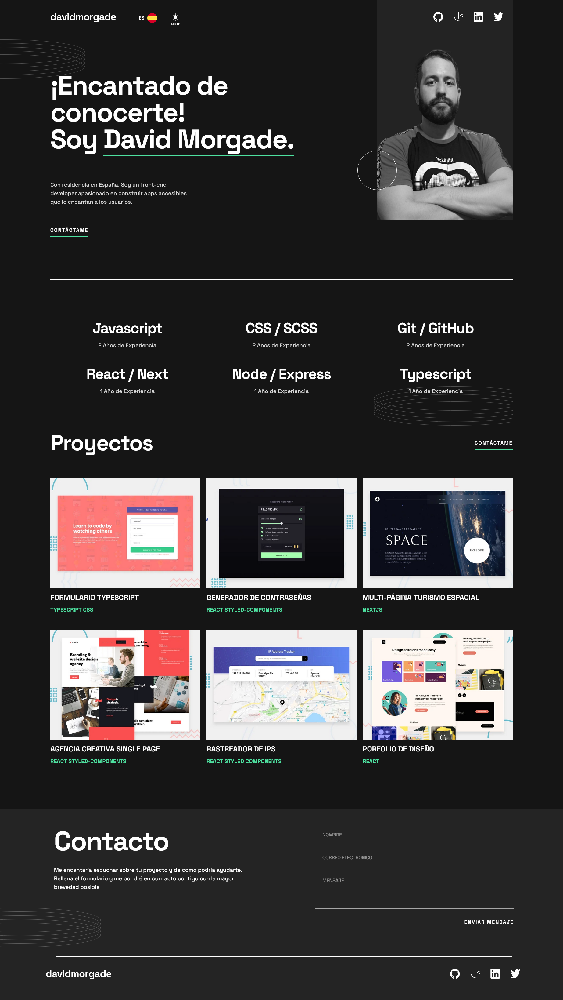
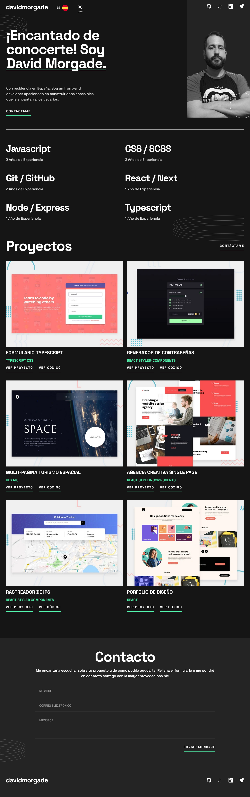

# Frontend Mentor - Single-page developer portfolio solution

This is a solution to the [Single-page developer portfolio challenge on Frontend Mentor](https://www.frontendmentor.io/challenges/singlepage-developer-portfolio-bBVj2ZPi-x).

## Table of contents

- [Frontend Mentor - Single-page developer portfolio solution](#frontend-mentor---single-page-developer-portfolio-solution)
  - [Table of contents](#table-of-contents)
  - [Overview](#overview)
    - [The challenge](#the-challenge)
    - [Screenshot](#screenshot)
    - [Links](#links)
  - [My process](#my-process)
    - [Built with](#built-with)
    - [Continued development](#continued-development)
  - [Author](#author)

## Overview

### The challenge

Users should be able to:

- Receive an error message when the `form` is submitted if:
  - Any field is empty
  - The email address is not formatted correctly
- View the optimal layout for the interface depending on their device's screen size
- See hover and focus states for all interactive elements on the page
- **Bonus**: Hook the form up so it sends and stores the user's enquiry (you can use a spreadsheet or Airtable to save the enquiries)
- **Bonus**: Add your own details (image, skills, projects) to replace the ones in the design

### Screenshot

Desktop Screenshot:

Tablet Screenshot:

Mobile Screenshot:

### Links

- Solution URL: [Solution](https://your-solution-url.com)
- Live Site URL: [Live Site](https://www.developermorgade.es/)
- Node Server Repository URL: [Node - Express - Nodemailer](https://github.com/DavidMorgade/Nodemailer-Server)

## My process

### Built with

- Semantic HTML5 markup
- Flexbox
- CSS Grid
- Mobile-first workflow
- [React](https://reactjs.org/) - JS library
- [Vite](https://vitejs.dev/) - React Bundler
- [Styled Components](https://styled-components.com/) - For styles
- [Node](https://nodejs.org/es/) - Server to handle data from the form
- [Express](https://expressjs.com/es/) - Framework for Node
- [Express-validator](https://express-validator.github.io/docs/) - Express middlewares
- [Nodemailer](https://nodemailer.com/about/) - Sends data to my Email

### Continued development

Missing features:

- Add more animations
- Change the profile image with an image with better quality
- Improve the "Skills" section animations

## Author

- Website - [David Morgade](https://www.developermorgade.es/)
- Frontend Mentor - [@DavidMorgade](https://www.frontendmentor.io/profile/DavidMorgade)
- Twitter - [@MeSabeAgridulce](https://www.twitter.com/MeSabeAgridulce)
